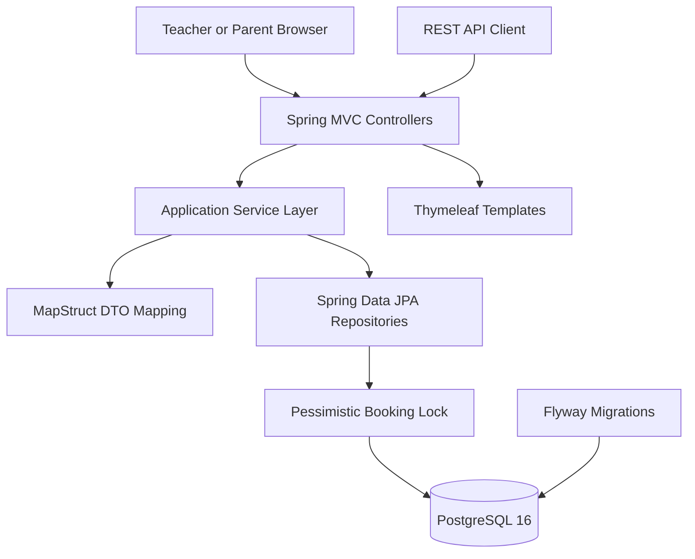
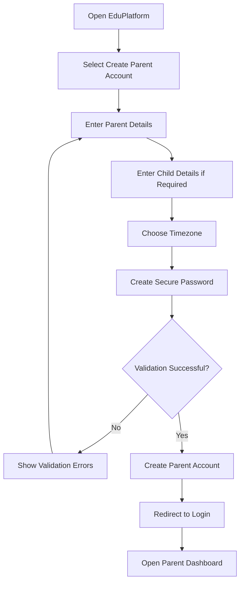
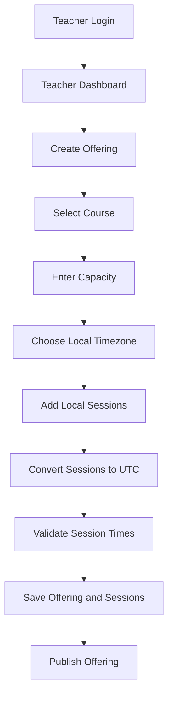
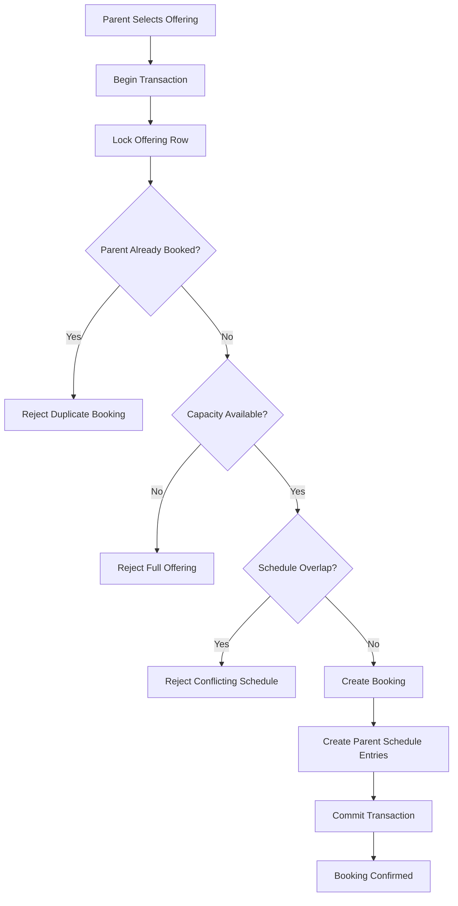

# 🌍 EduPlatform

<p align="center">
  <strong>Global Live-Learning Booking Platform for Teachers, Parents, and Students</strong>
</p>

<p align="center">
  Create learning batches, publish timezone-aware sessions, register parent accounts, and book seats safely without overbooking or schedule conflicts.
</p>

<p align="center">
  <a href="https://learning-platform-1-mkyt.onrender.com">
    
  </a>
  <a href="#-getting-started">
    
  </a>
  <a href="#-api-reference">
    
  </a>
</p>

<p align="center">
  
  
  
  
  
  
</p>

---

## 📌 Table of Contents

- [Overview](#-overview)
- [Live Deployment](#-live-deployment)
- [Demo Accounts](#-demo-accounts)
- [Platform Capabilities](#-platform-capabilities)
- [Technology Stack](#-technology-stack)
- [System Architecture](#-system-architecture)
- [Core Business Flows](#-core-business-flows)
- [Database Design and Concurrency](#-database-design-and-concurrency)
- [Timezone Strategy](#-timezone-strategy)
- [Project Structure](#-project-structure)
- [Getting Started](#-getting-started)
- [Configuration](#-configuration)
- [Using the Platform](#-using-the-platform)
- [API Reference](#-api-reference)
- [Validation and Error Handling](#-validation-and-error-handling)
- [Testing](#-testing)
- [Deployment](#-deployment)
- [Security Recommendations](#-security-recommendations)
- [Troubleshooting](#-troubleshooting)
- [Roadmap](#-roadmap)
- [Contributing](#-contributing)
- [License](#-license)

---

# 🚀 Overview

**EduPlatform** is a production-oriented live-learning booking application built with **Java 21**, **Spring Boot**, **PostgreSQL**, **Thymeleaf**, **Flyway**, and **Docker**.

The platform supports two primary user groups:

- **Teachers**, who create and manage live-learning course offerings.
- **Parents**, who register their own accounts, browse available batches, and reserve seats for their children.

The application is designed for global usage. Teachers may create sessions in their local timezone, while the platform converts and stores all session timestamps consistently in UTC.

EduPlatform also protects critical booking operations using application-level transactions, pessimistic database locking, unique constraints, and PostgreSQL exclusion constraints.

---

# 🌐 Live Deployment

<p align="center">
  <a href="https://learning-platform-1-mkyt.onrender.com">
    
  </a>
</p>

---

# 🔐 Demo Accounts

The following accounts may be used to demonstrate the application after deployment.

## Teacher Demo Account

| Field | Value |
|---|---|
| Role | Teacher |
| Email | `teacher@edu.com` |
| Password | `password` |
| Access | Create and manage live-learning offerings |

## Parent Demo Account

| Field | Value |
|---|---|
| Role | Parent |
| Email | `parent@edu.com` |
| Password | `password` |
| Access | Browse offerings and book seats |

> Demo credentials should be created through a Flyway seed migration or secure deployment seed process. Never publish real production administrator credentials in the repository.

---

# ✨ Platform Capabilities

## 👨‍🏫 Teacher Features

- Secure teacher login
- Teacher-specific dashboard
- Create live-learning batch offerings
- Select a course and teacher profile
- Set batch title and description
- Define maximum seat capacity
- Choose a valid IANA timezone
- Add one or more learning sessions
- View available and booked capacity
- Manage published offerings
- Review enrolled parents or students

## 👨‍👩‍👧 Parent Features

- Parent self-registration
- Secure parent login
- Parent-specific dashboard
- Browse available learning offerings
- View session dates and timings
- View teacher, course, timezone, and capacity details
- Book a seat for a child
- Prevent duplicate bookings
- Prevent overlapping class schedules
- Review confirmed bookings
- Manage parent profile information

## ⚙️ Platform Features

- Integrated Thymeleaf frontend
- Responsive glassmorphism-style interface
- RESTful JSON APIs
- Transaction-safe booking operations
- Pessimistic locking for capacity control
- Unique booking constraints
- PostgreSQL GiST exclusion constraints
- UTC-based global scheduling
- DTO-based API contracts
- MapStruct object mapping
- Jakarta Bean Validation
- Flyway database migrations
- Docker and Docker Compose support
- Environment-based configuration
- Production deployment compatibility

---

# 🛠️ Technology Stack

| Layer | Technology | Purpose |
|---|---|---|
| Language | Java 21 | Modern Java runtime, records, improved performance, and long-term support |
| Backend | Spring Boot 3.3.0 | Application bootstrap, dependency management, configuration, and production support |
| Web | Spring MVC | REST controllers and server-rendered web routes |
| UI | Thymeleaf, HTML5, CSS3, JavaScript | Integrated teacher and parent web interface |
| Persistence | Spring Data JPA | Repository abstraction and ORM integration |
| ORM | Hibernate | Entity mapping, transactions, and database persistence |
| Database | PostgreSQL 16 | Relational storage, constraints, locking, and range support |
| Migration | Flyway | Version-controlled database schema evolution |
| Mapping | MapStruct 1.5.5.Final | Compile-time entity and DTO mapping |
| Validation | Jakarta Bean Validation | Request and form validation |
| Build | Maven / Maven Wrapper | Build lifecycle and dependency management |
| Containerization | Docker | Portable application packaging |
| Orchestration | Docker Compose | Local application and database startup |
| Testing | JUnit 5, Spring Boot Test, Mockito | Unit, integration, and application testing |
| Deployment | Render, Railway, AWS, Azure, or equivalent | Public hosting and managed infrastructure |

---

# 🏗️ System Architecture

## High-Level Architecture



## Layered Architecture

```text
┌────────────────────────────────────────────────────────┐
│                  Presentation Layer                    │
│  Thymeleaf Pages • REST Controllers • Form Validation  │
└───────────────────────────┬────────────────────────────┘
                            │
                            ▼
┌────────────────────────────────────────────────────────┐
│                  Application Layer                     │
│  Booking Services • Offering Services • Authentication │
│  Capacity Rules • Timezone Conversion • Transactions   │
└───────────────────────────┬────────────────────────────┘
                            │
                            ▼
┌────────────────────────────────────────────────────────┐
│                   Persistence Layer                    │
│ Spring Data JPA • Hibernate • Pessimistic Write Locks  │
└───────────────────────────┬────────────────────────────┘
                            │
                            ▼
┌────────────────────────────────────────────────────────┐
│                     Data Layer                         │
│ PostgreSQL • Unique Constraints • GiST Exclusion Rules │
│ UTC Session Storage • Flyway Schema History            │
└────────────────────────────────────────────────────────┘
```

---

# 🔄 Core Business Flows

## Parent Registration Flow



## Teacher Offering Creation Flow



## Safe Booking Flow



---


The `&&` operator returns true when two ranges overlap.

## 5. Why Both Application and Database Validation Are Used

| Protection | Responsibility |
|---|---|
| Service validation | Produces understandable business error messages |
| Transaction boundary | Keeps booking operations atomic |
| Pessimistic lock | Serializes capacity-sensitive booking requests |
| Unique constraint | Prevents duplicate booking records |
| Exclusion constraint | Prevents overlapping parent schedules |
| Database transaction | Rolls back partial booking changes |

---

# 🌍 Timezone Strategy

Teachers create sessions using a local date, local time, and IANA timezone.

Example input:

```json
{
  "timeZone": "Asia/Kolkata",
  "startLocal": "2026-08-01T10:00",
  "endLocal": "2026-08-01T12:00"
}
```

The application converts local session times to UTC before storage:

```java
ZoneId zoneId = ZoneId.of(request.timeZone());

Instant startUtc = request.startLocal()
    .atZone(zoneId)
    .toInstant();

Instant endUtc = request.endLocal()
    .atZone(zoneId)
    .toInstant();
```

Recommended PostgreSQL column type:

```sql
TIMESTAMP WITH TIME ZONE
```

Display conversion:

```text
Teacher local input
        ↓
IANA timezone validation
        ↓
ZonedDateTime
        ↓
UTC Instant
        ↓
PostgreSQL storage
        ↓
Convert to viewer timezone for display
```

This strategy helps avoid:

- Incorrect offsets
- Server timezone dependency
- Daylight-saving errors
- Region-to-region scheduling inconsistencies
- Ambiguous local timestamps

---

# 🚀 Getting Started

## Prerequisites

### Docker-Based Setup

Install:

- Git
- Docker Desktop
- Docker Compose

### Local IDE Setup

Install:

- Java 21
- Git
- PostgreSQL 16 or Docker Desktop
- IntelliJ IDEA, Eclipse, or VS Code
- Maven 3.9+, or use the included Maven Wrapper

---

## Run with Docker Compose

### 1. Clone the repository

```bash
git clone YOUR_GITHUB_REPOSITORY_URL
cd learning-platform
```

### 3. Build and start the platform

```bash
docker compose up -d --build
```

### 4. Check container status

```bash
docker compose ps
```

### 5. Follow application logs

```bash
docker compose logs -f app
```

### 6. Open the application

```text
http://localhost:8080
```

### 7. Stop the application

```bash
docker compose down
```

### 8. Stop and remove database data

```bash
docker compose down -v
```

> The `-v` option permanently removes the local PostgreSQL volume.

---

## Run Locally from an IDE

### 1. Start PostgreSQL through Docker

```bash
docker compose up -d postgres
```

### 2. Run with Maven Wrapper

Linux or macOS:

```bash
./mvnw spring-boot:run
```

Windows:

```powershell
mvnw.cmd spring-boot:run
```

### 3. Run from IntelliJ IDEA

Open:

```text
src/main/java/.../LearningPlatformApplication.java
```

Run the `main()` method.

---

# ⚙️ Configuration

## Environment Variables

| Variable | Required | Default | Description |
|---|---:|---|---|
| `DB_HOST` | Yes in production | `localhost` | PostgreSQL hostname |
| `DB_PORT` | No | `5432` | PostgreSQL port |
| `DB_NAME` | Yes | `learning_platform` | Database name |
| `DB_USERNAME` | Yes | `postgres` | Database username |
| `DB_PASSWORD` | Yes | `postgres` | Database password |
| `SERVER_PORT` | No | `8080` | Application port |
| `SPRING_PROFILES_ACTIVE` | No | `default` | Active Spring profile |
| `JAVA_OPTS` | No | Empty | JVM runtime options |
| `APP_BASE_URL` | Recommended | `http://localhost:8080` | Public application URL |


---

# 🧑‍💻 Using the Platform

## Parent Registration

1. Open the EduPlatform home page.
2. Select **Create Parent Account**.
3. Enter the parent’s full name.
4. Enter a unique email address.
5. Enter a phone number.
6. Select a preferred timezone.
7. Enter child details when required.
8. Create and confirm a secure password.
9. Submit the registration form.
10. Log in with the newly created account.


Recommended API endpoint:

```http
POST /api/auth/parents/register
```

Example request:

```json
{
  "fullName": "Anita Sharma",
  "email": "anita.sharma@example.com",
  "phoneNumber": "9876543210",
  "password": "Parent@123",
  "timeZone": "Asia/Kolkata",
  "children": [
    {
      "name": "Aarav Sharma",
      "age": 12,
      "grade": "Grade 7"
    }
  ]
}
```

## Teacher Usage

1. Log in with a teacher account.
2. Open the Teacher Dashboard.
3. Select **Create Offering**.
4. Choose a course.
5. Enter the offering title.
6. Set maximum seat capacity.
7. Select the teacher’s local timezone.
8. Add one or more sessions.
9. Review converted session details.
10. Publish the offering.

## Parent Booking Usage

1. Register or log in as a parent.
2. Open the Parent Dashboard.
3. Browse active offerings.
4. Review teacher, course, sessions, and available seats.
5. Select an offering.
6. Select a child when multiple children are registered.
7. Click **Book Seat**.
8. Review the confirmation.
9. View the booking under **My Bookings**.

---

# 📡 API Reference

> The exact routes should match the controller mappings in the source code. Update this section if your implementation uses different prefixes.

## Authentication and Registration

| Method | Endpoint | Description |
|---|---|---|
| `POST` | `/api/auth/parents/register` | Register a new parent account |
| `POST` | `/api/auth/login` | Authenticate a user |
| `POST` | `/api/auth/logout` | End the active session |
| `GET` | `/api/auth/me` | Get the authenticated user |

### Register Parent

```http
POST /api/auth/parents/register
Content-Type: application/json
```

```json
{
  "fullName": "Anita Sharma",
  "email": "anita.sharma@example.com",
  "phoneNumber": "9876543210",
  "password": "Parent@123",
  "timeZone": "Asia/Kolkata"
}
```

### Login

```http
POST /api/auth/login
Content-Type: application/json
```

```json
{
  "email": "parent@edu.com",
  "password": "password"
}
```

---

## Offerings

| Method | Endpoint | Description |
|---|---|---|
| `GET` | `/offerings` | List available offerings |
| `GET` | `/offerings/{id}` | Get offering details |
| `POST` | `/offerings` | Create a new offering |
| `PUT` | `/offerings/{id}` | Update an offering |
| `DELETE` | `/offerings/{id}` | Remove or cancel an offering |

### Create Offering

```http
POST /offerings
Content-Type: application/json
```

```json
{
  "courseId": 1,
  "teacherId": 2,
  "title": "Summer Python Camp",
  "description": "Interactive Python fundamentals for school students.",
  "maxCapacity": 10,
  "timeZone": "Asia/Kolkata",
  "sessions": [
    {
      "startLocal": "2026-08-01T10:00",
      "endLocal": "2026-08-01T12:00"
    },
    {
      "startLocal": "2026-08-03T10:00",
      "endLocal": "2026-08-03T12:00"
    }
  ]
}
```

Example cURL:

```bash
curl -X POST "http://localhost:8080/offerings" \
  -H "Content-Type: application/json" \
  -d '{
    "courseId": 1,
    "teacherId": 2,
    "title": "Summer Python Camp",
    "description": "Interactive Python fundamentals for school students.",
    "maxCapacity": 10,
    "timeZone": "Asia/Kolkata",
    "sessions": [
      {
        "startLocal": "2026-08-01T10:00",
        "endLocal": "2026-08-01T12:00"
      }
    ]
  }'
```

---

## Bookings

| Method | Endpoint | Description |
|---|---|---|
| `GET` | `/bookings?parentId={id}` | List bookings for a parent |
| `GET` | `/bookings/{id}` | Get booking details |
| `POST` | `/bookings` | Reserve a seat |
| `DELETE` | `/bookings/{id}` | Cancel a booking |

### Create Booking

```http
POST /bookings
Content-Type: application/json
```

```json
{
  "parentId": 5,
  "childId": 8,
  "offeringId": 1
}
```

Example cURL:

```bash
curl -X POST "http://localhost:8080/bookings" \
  -H "Content-Type: application/json" \
  -d '{
    "parentId": 5,
    "childId": 8,
    "offeringId": 1
  }'
```

---

## Suggested HTTP Status Codes

| Status | Usage |
|---|---|
| `200 OK` | Successful retrieval or update |
| `201 Created` | Account, offering, or booking created |
| `204 No Content` | Successful deletion |
| `400 Bad Request` | Validation or malformed request |
| `401 Unauthorized` | Authentication required or failed |
| `403 Forbidden` | Authenticated user lacks permission |
| `404 Not Found` | Requested resource does not exist |
| `409 Conflict` | Duplicate booking, full offering, or schedule conflict |
| `422 Unprocessable Entity` | Valid JSON with invalid business data |
| `500 Internal Server Error` | Unexpected server failure |

---

# ✅ Validation and Error Handling

## Parent Registration Validation

- Full name is required
- Email must be valid
- Email must be unique
- Phone number must be valid
- Password must meet security requirements
- Password and confirmation must match
- Timezone must be a valid IANA timezone
- Child information must be valid when provided

## Offering Validation

- Course must exist
- Teacher must exist
- Title is required
- Maximum capacity must be greater than zero
- At least one session is required
- Session start must be before session end
- Timezone must be valid
- Duplicate or invalid sessions must be rejected

## Booking Validation

- Parent must exist
- Child must belong to the parent
- Offering must exist and be active
- Parent must not already have the same offering
- Offering must have available capacity
- Offering sessions must not overlap existing parent bookings


---

## Recommended Test Coverage

### Unit Tests

- Timezone conversion
- Capacity validation
- Duplicate booking detection
- Parent registration validation
- Password confirmation validation
- Entity-to-DTO mapping
- Service exception behavior

### Repository Tests

- Pessimistic lock query
- Booking count query
- Unique booking constraint
- Schedule exclusion constraint
- Offering session persistence

### Integration Tests

- Successful parent registration
- Duplicate email rejection
- Teacher login
- Parent login
- Offering creation
- Successful booking
- Full-capacity rejection
- Duplicate booking rejection
- Overlapping schedule rejection
- Transaction rollback behavior

### Concurrency Tests

A key integration test should create multiple simultaneous booking requests for the final available seat and verify that only one succeeds.

Expected result:

```text
Concurrent booking requests: 20
Available seats: 1
Successful bookings: 1
Rejected bookings: 19
Final confirmed booking count: 1
```

---

# 📦 Build Commands

## Clean and Compile

```bash
./mvnw clean compile
```

## Build JAR

```bash
./mvnw clean package
```

## Build Without Tests

```bash
./mvnw clean package -DskipTests
```

## Run Packaged Application

```bash
java -jar target/*.jar
```

## Build Docker Image

```bash
docker build -t eduplatform:latest .
```

## Run Docker Image

```bash
docker run --rm \
  -p 8080:8080 \
  -e DB_HOST=host.docker.internal \
  -e DB_PORT=5432 \
  -e DB_NAME=learning_platform \
  -e DB_USERNAME=postgres \
  -e DB_PASSWORD=postgres \
  eduplatform:latest
```

---

# ☁️ Deployment

## Generic Production Deployment

A production deployment requires:

1. A managed PostgreSQL database
2. A Java or Docker-compatible web service
3. Environment variables
4. A public application URL
5. HTTPS
6. Persistent database storage
7. Health checks and logs

## Render Example

### Build Command

```bash
./mvnw clean package -DskipTests
```

# 🔒 Security Recommendations

Before exposing EduPlatform publicly:

- Use Spring Security
- Hash passwords using BCrypt or Argon2
- Never store plain-text passwords
- Use secure session cookies
- Enable CSRF protection for server-rendered forms
- Apply role-based authorization
- Restrict teacher-only endpoints
- Restrict parent data to the authenticated parent
- Validate resource ownership
- Enforce HTTPS
- Store secrets only in environment variables
- Rotate demo passwords regularly
- Add login rate limiting
- Add account lockout protection
- Validate redirect URLs
- Sanitize user-controlled text
- Configure strict CORS rules
- Disable detailed stack traces in production
- Enable database backups
- Add audit logging for booking changes

Recommended access matrix:

| Capability | Teacher | Parent |
|---|---:|---:|
| Register parent account | No | Public registration |
| Create offering | Yes | No |
| Update own offering | Yes | No |
| Browse offerings | Yes | Yes |
| Book a seat | No | Yes |
| View own bookings | No | Yes |
| View enrollment for own offering | Yes | No |
| View another user’s private data | No | No |

---

# 📊 Observability Recommendations

For production readiness, consider adding:

- Spring Boot Actuator
- Health and readiness probes
- Structured JSON logging
- Request correlation IDs
- Database connection-pool metrics
- Booking success and rejection counters
- Capacity-exceeded metrics
- Schedule-conflict metrics
- Slow-query monitoring
- Error-rate alerts
- Uptime monitoring

Suggested metrics:

```text
eduplatform.bookings.created
eduplatform.bookings.rejected.capacity
eduplatform.bookings.rejected.duplicate
eduplatform.bookings.rejected.schedule_conflict
eduplatform.parents.registered
eduplatform.offerings.created
```

---


Check migration history:

```sql
SELECT *
FROM flyway_schema_history
ORDER BY installed_rank;
```

<details>
<summary><strong>Application sometimes shows “Not Found” after deployment</strong></summary>

Verify:

- The route exists in the controller
- The deployment service is fully started
- The platform is not sleeping or restarting
- The requested dashboard ID exists
- The public URL uses the correct path
- Reverse proxy health checks target a valid route
- Database migrations completed successfully
- The application binds to the deployment platform’s assigned port
---

# 🗺️ Roadmap

- [ ] JWT-based API authentication
- [ ] Multiple children per parent
- [ ] Teacher account is fixed
- [ ] Parent Account creation
- [ ] Course categories
- [ ] Search and filtering
- [ ] Waitlist management
- [ ] Course cancellation by teacher
- [ ] Calendar integration
- [ ] OpenAPI and Swagger UI
---

# 🤝 Contributing

Contributions are welcome.

1. Fork the repository.
2. Create a feature branch.

```bash
git checkout -b feature/parent-registration
```

3. Make the required changes.
4. Add or update tests.
5. Commit the changes.

```bash
git commit -m "Add parent self-registration"
```

6. Push the branch.

```bash
git push origin feature/parent-registration
```

7. Open a pull request.

Please keep changes focused and include documentation for new endpoints, environment variables, migrations, and user-facing functionality.

---

# 📄 License

Add the selected license to the repository.

Example MIT notice:

```text
This project is licensed under the MIT License.
See the LICENSE file for details.
```

---

# 👨‍💻 Project Purpose

EduPlatform demonstrates how a Spring Boot application can solve real-world live-learning and booking challenges, including:

- Global timezone conversion
- Parent self-registration
- Role-specific user experiences
- Safe high-concurrency booking
- Transactional capacity enforcement
- Duplicate booking prevention
- Schedule overlap protection
- Database-level business rules
- Automated schema migrations
- Integrated frontend and backend delivery
- Containerized local and cloud deployment

---

<p align="center">
  <strong>🌍 Learn globally. Teach confidently. Book safely.</strong>
</p>

<p align="center">
  Built with Java 21, Spring Boot, PostgreSQL, Thymeleaf, Flyway, MapStruct, Maven, and Docker.
</p>

<p align="center">
  <a href="https://learning-platform-1-mkyt.onrender.com">Live Application</a>
  ·
  <a href="YOUR_GITHUB_REPOSITORY_URL/issues">Report an Issue</a>
  ·
  <a href="YOUR_GITHUB_REPOSITORY_URL/pulls">Contribute</a>
</p>
